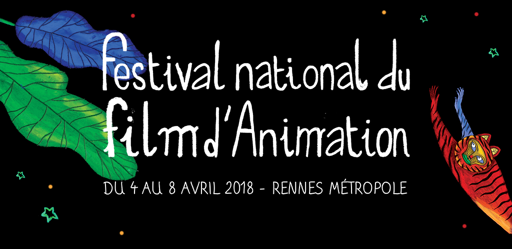

# Product
> Mobile application developed using Kotlin, for the National Animation Film Festival of Rennes organized by the AFCA. 

This application was developped as part of a course at GOBELINS, l'école de l'image. We chose to develop it by using Kotlin. 

The festival takes place in Rennes from April 4 to 8, 2018 in multiple venues of the city.

This application allows people who download it during the festival to be able to find their way among the list of films broadcast and to be able to select the ones they wish to watch. 

They have the ability to sort the movies by day and by category. They can add movies to favorite, get details about them, and get information on rates, places, authors and categories of movies. Also, they can allow the app to send them notifications when movies will start. 



## Prerequisites

Download Android Studio here : [Android Studio][androidstudio]._

## Installation

```sh
git clone https://github.com/antoineabbou/app-afca-android
```

In Android Studio :

```sh
Sync Gradle File
```

## Download the application

The application was published recently in closed beta on the Play Store. You will find it out soon ! 

_Download link here : [FNFA][fnfa]._


## Meta

Antoine Abbou – [@antoineabbou](https://twitter.com/antoineabbou) – [https://github.com/antoineabbou](https://github.com/antoineabbou/)

Arnaud Pinot – [@PinotArnaud](https://twitter.com/PinotArnaud) – [https://github.com/arnvvd](https://github.com/arnvvd/)

<!-- Markdown link & img dfn's -->
[build-url]: https://travis-ci.org/dbader/node-datadog-metrics
[fnfa]: https://play.google.com/store/apps/details?id=com.pibbou.afca
[androidstudio]: https://developer.android.com/studio/index.html